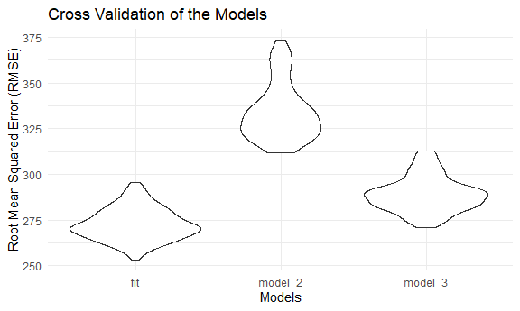
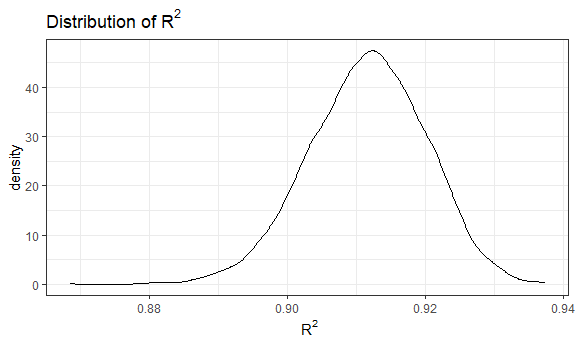

Homework \#6
================
Lynn Chen

## Problem 1:

``` r
birthweight = read_csv("./data/birthweight.csv")
```

    ## Rows: 4342 Columns: 20

    ## -- Column specification --------------------------------------------------------
    ## Delimiter: ","
    ## dbl (20): babysex, bhead, blength, bwt, delwt, fincome, frace, gaweeks, malf...

    ## 
    ## i Use `spec()` to retrieve the full column specification for this data.
    ## i Specify the column types or set `show_col_types = FALSE` to quiet this message.

``` r
## Clean the data 

birthweight = birthweight %>% 
  janitor::clean_names() %>% 
  mutate(
    babysex = factor(babysex, levels = c("1", "2")),
    babysex = fct_recode(babysex, "Female" = "2", "Male" = "1"),
    frace = factor(frace, 
                       levels = c("1", "2", "3", "4", "5", "6", "7", "8", "9")),
    frace = fct_recode(frace, 
                       "White" = "1",
                       "Black" = "2",
                       "Asian" = "3",
                       "Puerto Rican" = "4", 
                       "Other" = "8",
                       "Unknown" = "9"),
    malform = factor(malform, labels = c("Absent", "Present")),
    mrace = factor(mrace,  c(1, 2, 3, 4, 8)),
    mrace = fct_recode(mrace, 
                       "White" = "1",
                       "Black" = "2",
                       "Asian" = "3",
                       "Puerto Rican" = "4", 
                       "Other" = "8"))

## check for missing values
apply(is.na(birthweight),2,sum)
```

    ##  babysex    bhead  blength      bwt    delwt  fincome    frace  gaweeks 
    ##        0        0        0        0        0        0        0        0 
    ##  malform menarche  mheight   momage    mrace   parity  pnumlbw  pnumsga 
    ##        0        0        0        0        0        0        0        0 
    ##    ppbmi     ppwt   smoken   wtgain 
    ##        0        0        0        0

``` r
sum(!complete.cases(birthweight))
```

    ## [1] 0

-   This dataset contains 4342 rows and 20 columns. There are no missing
    values in the data!! YAY!

For the regression model, in order to choose more meaningful set of
predictors for the most appropriate model, I use stepwise regression
with backward selection which will starts with a saturated model and
eliminates variables each step to find a final model that best explains
the birthweight data.

``` r
model_1 = 
  lm(bwt ~ ., data = birthweight) %>% 
  step(direction = "backward", trace = 0) %>% 
  broom::tidy() %>% 
  knitr::kable()
```

The chosen model after performing stepwise regression include the
following predictors:`babysex`, `bhead`, `blength`, `delwt`, `fincome`,
`gaweeks`, `mheight`, `mrace`, `parity`, `ppwt`, and `smoken`.

``` r
fit = lm(bwt ~ babysex + bhead + blength + delwt + fincome + gaweeks + mheight + mrace + parity + ppwt + smoken, data = birthweight) 
summary(fit)
```

    ## 
    ## Call:
    ## lm(formula = bwt ~ babysex + bhead + blength + delwt + fincome + 
    ##     gaweeks + mheight + mrace + parity + ppwt + smoken, data = birthweight)
    ## 
    ## Residuals:
    ##      Min       1Q   Median       3Q      Max 
    ## -1097.18  -185.52    -3.39   174.14  2353.44 
    ## 
    ## Coefficients:
    ##                     Estimate Std. Error t value Pr(>|t|)    
    ## (Intercept)       -6098.8219   137.5463 -44.340  < 2e-16 ***
    ## babysexFemale        28.5580     8.4549   3.378 0.000737 ***
    ## bhead               130.7770     3.4466  37.944  < 2e-16 ***
    ## blength              74.9471     2.0190  37.120  < 2e-16 ***
    ## delwt                 4.1067     0.3921  10.475  < 2e-16 ***
    ## fincome               0.3180     0.1747   1.820 0.068844 .  
    ## gaweeks              11.5925     1.4621   7.929 2.79e-15 ***
    ## mheight               6.5940     1.7849   3.694 0.000223 ***
    ## mraceBlack         -138.7925     9.9071 -14.009  < 2e-16 ***
    ## mraceAsian          -74.8868    42.3146  -1.770 0.076837 .  
    ## mracePuerto Rican  -100.6781    19.3247  -5.210 1.98e-07 ***
    ## parity               96.3047    40.3362   2.388 0.017004 *  
    ## ppwt                 -2.6756     0.4274  -6.261 4.20e-10 ***
    ## smoken               -4.8434     0.5856  -8.271  < 2e-16 ***
    ## ---
    ## Signif. codes:  0 '***' 0.001 '**' 0.01 '*' 0.05 '.' 0.1 ' ' 1
    ## 
    ## Residual standard error: 272.3 on 4328 degrees of freedom
    ## Multiple R-squared:  0.7181, Adjusted R-squared:  0.7173 
    ## F-statistic: 848.1 on 13 and 4328 DF,  p-value: < 2.2e-16

``` r
birthweight %>% 
    add_predictions(fit) %>% 
    add_residuals(fit) %>% 
    ggplot(aes(x = pred, y = resid)) +
    geom_point(alpha = 0.2)  + 
    geom_smooth(se = F, color = "red", method = "lm", size = 1, linetype = 2) + 
    labs(title = "Residuals vs. Predicted Values", 
       x = "Predicted", 
       y = "Residuals")
```

    ## `geom_smooth()` using formula 'y ~ x'


According to the residuals against fitted values plot, the residuals are
roughly symmetrical around y = 0. The residuals seems to be evenly
distributed and the normal distribution of residuals assumption is
satisfied for linear regression. There are a few data points with low
fitted values and high residuals, majority of data points cluster around
predicted values 2500 - 4000.

### Compare models

-   **Model 2**: bwt \~ blength + gaweeks

-   **Model 3**: bwt \~ babysex + blength + bhead + babysex \* blength +
    babysex \* bhead + blength \* bhead + babysex \* blength \* bhead

``` r
model_2 = lm(bwt ~ blength + gaweeks, data = birthweight) 

model_2 %>% 
  broom::tidy() %>% 
  knitr::kable()
```

| term        |    estimate | std.error | statistic | p.value |
|:------------|------------:|----------:|----------:|--------:|
| (Intercept) | -4347.66707 | 97.958360 | -44.38281 |       0 |
| blength     |   128.55569 |  1.989891 |  64.60439 |       0 |
| gaweeks     |    27.04673 |  1.717930 |  15.74379 |       0 |

``` r
birthweight %>% 
  add_predictions(model_2) %>% 
  add_residuals(model_2) %>% 
  ggplot(aes(x = pred, y = resid)) +
  geom_point(alpha = 0.2) +
  geom_smooth(se = F, color = "red", method = "lm", size = 1, linetype = 2) + 
    labs(title = "Residuals vs. Predicted Values", 
       x = "Predicted", 
       y = "Residuals")
```

    ## `geom_smooth()` using formula 'y ~ x'


``` r
model_3 = lm(bwt ~ babysex * blength * bhead, data = birthweight) 
model_3 %>% 
  broom::tidy() %>% 
  knitr::kable()
```

| term                        |      estimate |    std.error |  statistic |   p.value |
|:----------------------------|--------------:|-------------:|-----------:|----------:|
| (Intercept)                 | -7176.8170221 | 1264.8397394 | -5.6740920 | 0.0000000 |
| babysexFemale               |  6374.8683508 | 1677.7669213 |  3.7996150 | 0.0001469 |
| blength                     |   102.1269235 |   26.2118095 |  3.8962180 | 0.0000992 |
| bhead                       |   181.7956350 |   38.0542051 |  4.7772811 | 0.0000018 |
| babysexFemale:blength       |  -123.7728875 |   35.1185360 | -3.5244319 | 0.0004288 |
| babysexFemale:bhead         |  -198.3931810 |   51.0916850 | -3.8830816 | 0.0001047 |
| blength:bhead               |    -0.5536096 |    0.7802092 | -0.7095656 | 0.4780117 |
| babysexFemale:blength:bhead |     3.8780531 |    1.0566296 |  3.6702106 | 0.0002453 |

``` r
birthweight %>% 
  add_predictions(model_3) %>% 
  add_residuals(model_3) %>% 
  ggplot(aes(x = pred, y = resid)) +
  geom_point(alpha = 0.2) +
  geom_smooth(se = F, color = "red", method = "lm", size = 1, linetype = 2) + 
    labs(title = "Residuals vs. Predicted Values", 
       x = "Predicted", 
       y = "Residuals")
```

    ## `geom_smooth()` using formula 'y ~ x'


``` r
birthweight_cv = 
  crossv_mc(birthweight, n = 100) %>% 
  mutate(
    train = map(train, as_tibble),
    test = map(test, as_tibble)
  ) %>% 
mutate(
    fit = map(.x = train, ~lm(bwt ~ babysex + bhead + blength + delwt + fincome + gaweeks + mheight + mrace + parity + ppwt + smoken, data = .x)),
    model_2 = map(.x = train, ~lm(bwt ~ blength + gaweeks, data = .x)),
    model_3 = map(.x = train, ~lm(bwt ~ babysex * blength * bhead, data = .x))
  ) %>% 
  mutate(
    rmse_fit = map2_dbl(.x = fit, .y = test, ~rmse(model = .x, data = .y)),
    rmse_model_2 = map2_dbl(.x = model_2, .y = test, ~rmse(model = .x, data = .y)),
    rmse_model_3 = map2_dbl(.x = model_3, .y = test, ~rmse(model = .x, data = .y))
  ) 
```

### Violin plot for RMSE

``` r
birthweight_cv %>% 
  select(starts_with("rmse")) %>% 
  pivot_longer(
    everything(),
    names_to = "model", 
    values_to = "rmse",
    names_prefix = "rmse_") %>%   
  ggplot(aes(x = model, y = rmse)) +
  geom_violin() +
  labs(
    title = "Cross Validation of the Models",
    x = "Models",
    y = "Root Mean Squared Error (RMSE)") 
```



-   Based on the violin plot, we see that the `fit` model has the lowest
    relative RMSE which indicates a better fit, so we conclude that it
    fits the data better than `model_2` and `model_3`.

## Problem 2:

``` r
## load the data
weather_df = 
  rnoaa::meteo_pull_monitors(
    c("USW00094728"),
    var = c("PRCP", "TMIN", "TMAX"), 
    date_min = "2017-01-01",
    date_max = "2017-12-31") %>%
  mutate(
    name = recode(id, USW00094728 = "CentralPark_NY"),
    tmin = tmin / 10,
    tmax = tmax / 10) %>%
  select(name, id, everything()) 
```

    ## Registered S3 method overwritten by 'hoardr':
    ##   method           from
    ##   print.cache_info httr

    ## using cached file: C:\Users\linqc\AppData\Local/Cache/R/noaa_ghcnd/USW00094728.dly

    ## date created (size, mb): 2021-10-05 10:31:27 (7.617)

    ## file min/max dates: 1869-01-01 / 2021-10-31

### Bootstrapping

``` r
boot_strap = 
  weather_df %>% 
  bootstrap(n = 5000, id = "strap_number") %>% 
  mutate(
    models = map(.x = strap, ~lm(tmax ~ tmin, data = .x)),
    tidy = map(models, broom::tidy),
    results_glance = map(models, broom::glance)) %>% 
  unnest(tidy, results_glance) %>% 
  select(strap_number, r.squared, term, estimate) %>% 
  pivot_wider(
    names_from = "term",
    values_from = "estimate"
  ) %>% 
  janitor::clean_names() %>%
  rename(
    beta_0 = intercept,
    beta_1 = tmin
  ) %>% 
  mutate(log_fct = log(beta_0 * beta_1))
```

### R Squared

``` r
boot_strap %>%
  ggplot(aes(x = r_squared)) +
  geom_density() +
  labs(
    title = "Distribution of" ~R^2,
    x = ~R^2) +
  theme_bw()
```



-   From the *R*<sup>2</sup> density plot, the distribution of
    *R*<sup>2</sup> seems to follow a normal distribution, with center
    around 0.912. Since *R*<sup>2</sup> value falls between 0 and 1, it
    indicates how much variation in `y` can be explained by `x`. Thus,
    we can conclude that a majority of the variation in `tmax` is
    explained by `tmin`.

### Log Function

``` r
ggplot(data = boot_strap, aes(x = log_fct)) +
  geom_density() +
  labs(
    title = "Distribution of" ~log(hat(beta)[0] %*% hat(beta)[1]),
    x = ~log(hat(beta)[0] %*% hat(beta)[1])) +
  theme_bw()
```


-   The density plot of *l**o**g*(*β̂*<sub>0</sub> \* *β̂*<sub>1</sub>)
    appears to be normally distributed, and centered around 2.015.
